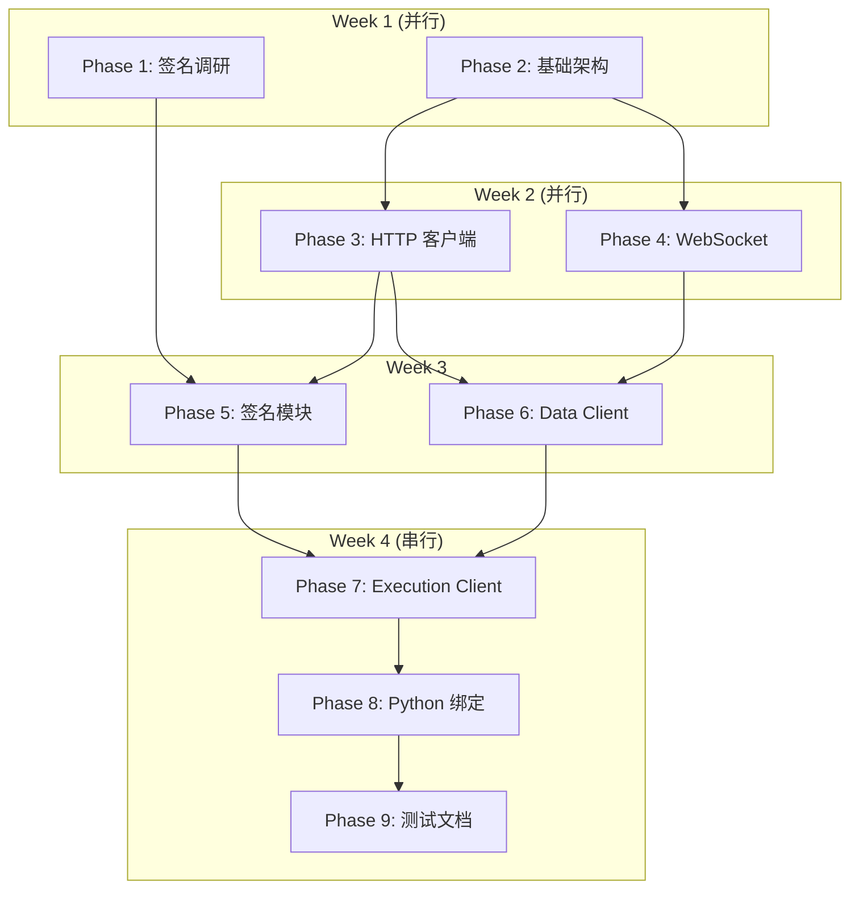

# NautilusTrader Lighter DEX Connector 实现计划

> **项目经理**: Claude Code Agent (PM-A)
> **创建日期**: 2025-12-14
> **状态**: 规划完成，待与 PM-B 方案整合

---

## 项目概述

为 NautilusTrader 实现 Lighter DEX 连接器，参考 Hyperliquid 适配器架构（DEX + 签名）和 hftbacktest 项目的开发经验。

| 项目 | 详情 |
|------|------|
| **目标** | Rust 核心实现 + PyO3 Python 绑定 |
| **功能** | 完整的市场数据、订单执行、账户信息支持 |
| **参考实现** | Hyperliquid (DEX签名), Bybit (架构模式), hftbacktest (Lighter经验) |
| **预计工期** | 20 个工作日（4 周） |

---

## 开发策略

### 并行开发模式（已确认）

```
┌─────────────────────────────────────────────────────────────────┐
│  Week 1                                                          │
│  ┌──────────────┐  ┌──────────────┐                             │
│  │ Phase 1      │  │ Phase 2      │  ← 并行启动                  │
│  │ 签名调研      │  │ 基础架构      │                             │
│  └──────────────┘  └──────────────┘                             │
├─────────────────────────────────────────────────────────────────┤
│  Week 2                                                          │
│  ┌──────────────┐  ┌──────────────┐                             │
│  │ Phase 3      │  │ Phase 4      │  ← HTTP/WS 可并行            │
│  │ HTTP 客户端   │  │ WebSocket    │                             │
│  └──────────────┘  └──────────────┘                             │
├─────────────────────────────────────────────────────────────────┤
│  Week 3                                                          │
│  ┌────────────────────────────────┐  ┌──────────────┐           │
│  │ Phase 5                        │  │ Phase 6      │           │
│  │ 签名模块（依赖调研结果）         │  │ Data Client  │  ← 部分并行│
│  └────────────────────────────────┘  └──────────────┘           │
├─────────────────────────────────────────────────────────────────┤
│  Week 4                                                          │
│  ┌──────────────┐  ┌──────────────┐  ┌──────────────┐           │
│  │ Phase 7      │  │ Phase 8      │  │ Phase 9      │           │
│  │ Exec Client  │→ │ Python 绑定  │→ │ 测试文档     │  ← 串行    │
│  └──────────────┘  └──────────────┘  └──────────────┘           │
└─────────────────────────────────────────────────────────────────┘
```

### 审核节奏（已确认）
- **逐阶段审核**: 每完成一个 Phase 提交审核，确保方向正确

---

## Phase 1: 签名方案调研 (Day 1)

### 目标
确定签名实现方案：FFI 调用 lighter-go 还是纯 Rust 实现

### 调研任务

| 任务 | 优先级 | 产出 |
|------|--------|------|
| 分析 lighter-go 签名算法 | P0 | 算法文档 |
| 检查 Rust 等效库 (ethers-rs, alloy) | P0 | 可行性报告 |
| 对比 Hyperliquid signing 实现 | P1 | 差异分析 |
| 技术决策 | P0 | FFI vs 纯 Rust 决定 |

### 关键文件参考
```
hftbacktest 项目:
- /home/deepzen/works/hftbacktest/connector/src/lighter/ffi.rs
- /home/deepzen/works/hftbacktest/connector/src/lighter/signer.rs

NautilusTrader 项目:
- crates/adapters/hyperliquid/src/signing/signers.rs
- crates/adapters/hyperliquid/src/signing/nonce.rs
```

### 决策标准
| 方案 | 优点 | 缺点 | 选择条件 |
|------|------|------|----------|
| FFI (lighter-go) | 已验证可行 | 依赖外部 .so | 签名算法复杂/专有 |
| 纯 Rust | 无外部依赖 | 需要实现验证 | 标准 EIP-712/ECDSA |

---

## Phase 2: 基础架构 (Day 2-3)

### 目录结构
```
crates/adapters/lighter/
├── Cargo.toml
├── README.md
├── docs/
│   └── IMPLEMENTATION_PLAN.md  # 本文档
├── src/
│   ├── lib.rs
│   ├── config.rs
│   ├── error.rs
│   └── common/
│       ├── mod.rs
│       ├── enums.rs      # LighterEnvironment, OrderType, TimeInForce
│       ├── types.rs      # MarketInfo, PriceDecimals
│       ├── urls.rs       # URL builders
│       ├── consts.rs     # LIGHTER_VENUE, chain IDs
│       └── parse.rs      # 价格精度转换
└── tests/
```

### 关键实现

#### `Cargo.toml`
```toml
[package]
name = "nautilus-lighter"
version = "0.1.0"
edition = "2024"

[dependencies]
nautilus-common = { path = "../../common" }
nautilus-core = { path = "../../core" }
nautilus-model = { path = "../../model" }
reqwest = { version = "0.12", features = ["json"] }
tokio = { version = "1", features = ["full"] }
tokio-tungstenite = "0.24"
serde = { version = "1", features = ["derive"] }
serde_json = "1"
thiserror = "2"
tracing = "0.1"

[features]
default = []
python = ["pyo3"]

[dev-dependencies]
rstest = "0.23"
```

#### `config.rs`
```rust
/// Lighter 数据客户端配置
#[derive(Clone, Debug)]
pub struct LighterDataClientConfig {
    pub environment: LighterEnvironment,  // Mainnet/Testnet
    pub base_url_http: Option<String>,
    pub base_url_ws: Option<String>,
    pub heartbeat_interval_secs: Option<u64>,  // 默认 60s (Lighter 120s 超时)
    pub http_timeout_secs: Option<u64>,
    pub max_retries: Option<u32>,
}

/// Lighter 执行客户端配置
#[derive(Clone, Debug)]
pub struct LighterExecClientConfig {
    pub private_key: String,       // 40字节 API Key
    pub account_index: u32,
    pub api_key_index: u8,         // 2-254 for programmatic trading
    pub chain_id: u32,             // 300=testnet, 304=mainnet
    pub environment: LighterEnvironment,
    pub order_prefix: Option<String>,  // 订单前缀，用于过滤
    pub gc_interval_secs: Option<u64>, // GC 间隔
    // ... HTTP/WS 配置继承
}
```

#### `common/parse.rs` - 动态价格精度（⚠️ 关键特性！）
```rust
/// Lighter 使用动态价格精度，不同市场精度不同
///
/// 公式:
/// - price_int = price_usd × (10 ** price_decimals)
/// - quantity_multiplier = 10^(6 - price_decimals)
///
/// 示例:
/// - ETH (price_decimals=2): $4127.39 × 100 = 412739
/// - BTC (price_decimals=1): $114357.8 × 10 = 1143578
/// - DOGE (price_decimals=6): $0.202095 × 1000000 = 202095

pub fn price_to_int(price: f64, price_decimals: u8) -> u64 {
    (price * 10f64.powi(price_decimals as i32)).round() as u64
}

pub fn int_to_price(price_int: u64, price_decimals: u8) -> f64 {
    price_int as f64 / 10f64.powi(price_decimals as i32)
}

pub fn quantity_multiplier(price_decimals: u8) -> u64 {
    10u64.pow(6 - price_decimals as u32)
}
```

### 修改现有文件
- `crates/adapters/Cargo.toml` - 添加 lighter workspace 成员
- `nautilus_trader/adapters/__init__.py` - 注册新适配器

---

## Phase 3: HTTP 客户端 (Day 4-5)

### 文件结构
```
src/http/
├── mod.rs
├── client.rs      # LighterHttpClient
├── models.rs      # 请求/响应模型
├── error.rs       # HTTP 错误类型
└── endpoints.rs   # API 端点常量
```

### API 端点

| 类别 | 端点 | 方法 | 说明 |
|------|------|------|------|
| 市场 | `/order_books` | GET | 获取所有市场（⚠️ 必须用这个发现市场） |
| 市场 | `/order_book_details/{id}` | GET | 市场详情 |
| 市场 | `/order_book_orders/{id}` | GET | 订单簿深度 |
| 市场 | `/recent_trades/{id}` | GET | 最近成交 |
| 账户 | `/account` | GET | 账户信息 |
| 账户 | `/account_active_orders` | GET | 活跃订单（需 auth） |
| 交易 | `/next_nonce` | GET | 获取下一个 nonce |
| 交易 | `/send_tx` | POST | 发送交易 |
| 交易 | `/send_tx_batch` | POST | 批量发送 |

### 关键数据结构
```rust
/// 市场信息（⚠️ price_decimals 是关键字段）
#[derive(Debug, Clone, Deserialize)]
pub struct MarketInfo {
    pub market_id: u32,
    pub base_symbol: String,
    pub quote_symbol: String,
    pub price_decimals: u8,     // ⚠️ 动态精度
    pub min_order_size: u64,
    pub tick_size: u64,
    pub status: MarketStatus,
}

/// 创建订单请求
#[derive(Debug, Serialize)]
pub struct CreateOrderRequest {
    pub market_index: u32,
    pub client_order_index: u64,
    pub base_amount: u64,       // 已乘以 quantity_multiplier
    pub price: u64,             // 已乘以 10^price_decimals
    pub is_ask: bool,           // true=卖, false=买
    pub order_type: u8,
    pub time_in_force: u8,
    pub reduce_only: bool,
    pub trigger_price: u64,
}
```

### 缓存策略
```rust
/// 市场信息缓存（防止 429 限流）
pub struct MarketCache {
    data: RwLock<HashMap<u32, MarketInfo>>,
    last_update: RwLock<Instant>,
    ttl: Duration,  // 默认 5 分钟
}
```

---

## Phase 4: WebSocket 客户端 (Day 6-7)

### 文件结构
```
src/websocket/
├── mod.rs
├── client.rs      # LighterWebSocketClient
├── messages.rs    # 消息类型定义
├── handler.rs     # 消息处理器
└── stream.rs      # 数据流管理
```

### WebSocket 频道

| 频道 | 类型 | 说明 |
|------|------|------|
| `market_stats/{market_id}` | 公共 | 市场统计（价格、资金费率） |
| `account_all_orders/{account}` | 私有 | 订单状态更新 |
| `account_all/{account}` | 私有 | 完整账户数据 |
| `user_stats/{account}` | 私有 | 账户统计（余额、保证金） |

### ⚠️ 关键：应用层心跳
```rust
/// Lighter 使用 JSON 级别的心跳，不是 WebSocket 协议级 ping/pong
/// 必须在 120 秒内响应 {"type": "pong"}，否则连接关闭

impl LighterWebSocketClient {
    async fn handle_message(&mut self, msg: &str) -> Result<Option<WsEvent>> {
        let parsed: WsMessage = serde_json::from_str(msg)?;

        match parsed {
            WsMessage::Ping => {
                // ⚠️ 必须响应应用层 pong
                self.send(r#"{"type": "pong"}"#).await?;
                Ok(None)
            }
            WsMessage::MarketStats(data) => Ok(Some(WsEvent::MarketStats(data))),
            WsMessage::AccountOrders(data) => Ok(Some(WsEvent::OrderUpdate(data))),
            // ...
        }
    }
}
```

### 消息类型
```rust
#[derive(Debug, Deserialize)]
#[serde(tag = "type")]
pub enum WsMessage {
    #[serde(rename = "ping")]
    Ping,

    #[serde(rename = "pong")]
    Pong,

    #[serde(rename = "subscribed")]
    Subscribed { channel: String },

    #[serde(rename = "update/market_stats")]
    MarketStats(MarketStatsData),

    #[serde(rename = "update/account_all_orders")]
    AccountOrders(AccountOrdersData),

    #[serde(rename = "update/user_stats")]
    UserStats(UserStatsData),
}
```

---

## Phase 5: 签名与 Nonce 管理 (Day 8-10)

### 文件结构
```
src/signing/
├── mod.rs
├── nonce.rs       # NonceManager
├── signer.rs      # LighterSigner
├── types.rs       # SignedTransaction, AuthToken
└── ffi.rs         # FFI 绑定（如果选择 FFI 方案）
```

### Nonce 管理（参考 hftbacktest 经验）
```rust
/// 线程安全的 Nonce 管理器
///
/// ⚠️ 关键点：
/// - Lighter 的 nonce 是 per-API-key 的，不是全局的
/// - 必须严格递增
/// - 签名失败时需要 rollback

pub struct NonceManager {
    nonce: AtomicU64,
    account_index: u32,
    api_key_index: u8,
}

impl NonceManager {
    pub fn new(initial: u64, account_index: u32, api_key_index: u8) -> Self {
        Self {
            nonce: AtomicU64::new(initial),
            account_index,
            api_key_index,
        }
    }

    pub fn next(&self) -> u64 {
        self.nonce.fetch_add(1, Ordering::SeqCst)
    }

    pub fn rollback(&self) {
        self.nonce.fetch_sub(1, Ordering::SeqCst);
    }

    pub fn current(&self) -> u64 {
        self.nonce.load(Ordering::SeqCst)
    }

    /// 从 API 同步 nonce（启动时或出错后）
    pub async fn sync_from_api(&self, client: &LighterHttpClient) -> Result<()> {
        let next = client.get_next_nonce(self.account_index, self.api_key_index).await?;
        self.nonce.store(next, Ordering::SeqCst);
        Ok(())
    }
}
```

### 签名器接口
```rust
pub trait LighterSigner: Send + Sync {
    fn create_auth_token(&self, deadline: i64) -> Result<String>;
    fn sign_create_order(&self, order: &CreateOrderRequest, nonce: u64) -> Result<SignedTransaction>;
    fn sign_cancel_order(&self, market_index: u32, order_index: u64, nonce: u64) -> Result<SignedTransaction>;
    fn sign_cancel_all_orders(&self, nonce: u64) -> Result<SignedTransaction>;
    fn sign_modify_order(&self, order_index: u64, new_price: u64, new_size: u64, nonce: u64) -> Result<SignedTransaction>;
}
```

### FFI 方案（如果选择）
```rust
// src/signing/ffi.rs

#[repr(C)]
struct StrOrErr {
    str_ptr: *mut c_char,
    err_ptr: *mut c_char,
}

#[link(name = "lighter-signer")]
unsafe extern "C" {
    fn CreateClient(
        private_key: *const c_char,
        chain_id: c_int,
        account_index: c_int,
        api_key_index: c_int,
    ) -> *mut c_char;

    fn SignCreateOrder(
        market_index: c_int,
        client_order_index: c_longlong,
        base_amount: c_longlong,
        price: c_longlong,
        is_ask: c_int,
        order_type: c_int,
        time_in_force: c_int,
        reduce_only: c_int,
        trigger_price: c_longlong,
        nonce: c_longlong,
    ) -> StrOrErr;

    fn CreateAuthToken(deadline: c_longlong) -> StrOrErr;
}
```

---

## Phase 6: Data Client (Day 11-12)

### 文件结构
```
src/data/
└── mod.rs         # LighterDataClient
```

### 实现
```rust
pub struct LighterDataClient {
    core: DataClientCore,
    config: LighterDataClientConfig,
    http_client: LighterHttpClient,
    ws_client: LighterWebSocketClient,
    instruments: HashMap<InstrumentId, MarketInfo>,
    subscriptions: HashSet<InstrumentId>,
}

impl DataClient for LighterDataClient {
    fn connect(&mut self) -> Result<()>;
    fn disconnect(&mut self) -> Result<()>;
    fn subscribe_order_book_deltas(&self, instrument_id: InstrumentId) -> Result<()>;
    fn subscribe_trades(&self, instrument_id: InstrumentId) -> Result<()>;
    fn subscribe_quote_ticks(&self, instrument_id: InstrumentId) -> Result<()>;
    fn unsubscribe(&self, instrument_id: InstrumentId) -> Result<()>;
}
```

### 数据流处理
```rust
impl LighterDataClient {
    async fn process_ws_message(&mut self, msg: WsEvent) -> Result<()> {
        match msg {
            WsEvent::MarketStats(data) => {
                // 转换为 NautilusTrader 的 QuoteTick
                let quote = self.parse_quote_tick(&data)?;
                self.core.handle_quote_tick(quote);
            }
            WsEvent::Trade(data) => {
                let trade = self.parse_trade_tick(&data)?;
                self.core.handle_trade_tick(trade);
            }
            // ...
        }
        Ok(())
    }
}
```

---

## Phase 7: Execution Client (Day 13-15)

### 文件结构
```
src/execution/
└── mod.rs         # LighterExecutionClient
```

### ⚠️ 关键：双通道订单确认
```rust
/// 订单状态跟踪（双通道确认机制）
///
/// Lighter 通过 REST 和 WebSocket 两个通道发送订单更新：
/// 1. REST 返回 tx_hash（立即）
/// 2. WebSocket 推送订单状态（稍后）
///
/// 只有两个通道都确认后才完全移除订单

#[derive(Debug)]
struct PendingOrder {
    client_order_id: ClientOrderId,
    venue_order_id: Option<VenueOrderId>,
    tx_hash: Option<String>,
    confirmed_by_rest: bool,
    confirmed_by_ws: bool,
    submitted_at: Instant,
    status: OrderStatus,
}

pub struct LighterExecutionClient {
    core: ExecutionClientCore,
    config: LighterExecClientConfig,
    http_client: LighterHttpClient,
    ws_client: LighterWebSocketClient,
    signer: Arc<dyn LighterSigner>,
    nonce_manager: NonceManager,
    pending_orders: Arc<RwLock<HashMap<ClientOrderId, PendingOrder>>>,
}
```

### ExecutionClient 实现
```rust
impl ExecutionClient for LighterExecutionClient {
    fn submit_order(&self, command: &SubmitOrder) -> Result<()> {
        let order = &command.order;

        // 1. 验证订单
        self.validate_order(order)?;

        // 2. 获取市场信息（用于精度转换）
        let market = self.get_market_info(order.instrument_id())?;

        // 3. 转换价格和数量
        let price_int = price_to_int(order.price().as_f64(), market.price_decimals);
        let qty_int = (order.quantity().as_f64() * quantity_multiplier(market.price_decimals) as f64) as u64;

        // 4. 获取 nonce 并签名
        let nonce = self.nonce_manager.next();
        let request = CreateOrderRequest { /* ... */ };

        let signed_tx = match self.signer.sign_create_order(&request, nonce) {
            Ok(tx) => tx,
            Err(e) => {
                self.nonce_manager.rollback();  // ⚠️ 签名失败要 rollback
                return Err(e);
            }
        };

        // 5. 发送并跟踪
        self.spawn_submit_task(order.client_order_id(), signed_tx);

        // 6. 生成 SUBMITTED 事件
        self.core.generate_order_submitted(/* ... */);

        Ok(())
    }

    fn cancel_order(&self, command: &CancelOrder) -> Result<()>;
    fn cancel_all_orders(&self, command: &CancelAllOrders) -> Result<()>;
    fn modify_order(&self, command: &ModifyOrder) -> Result<()>;
}
```

### GC 机制
```rust
impl LighterExecutionClient {
    /// 定期清理超时的 pending orders
    fn gc_pending_orders(&self) {
        let mut orders = self.pending_orders.write().unwrap();
        let now = Instant::now();
        let timeout = Duration::from_secs(self.config.gc_interval_secs.unwrap_or(300));

        orders.retain(|_, order| {
            if order.confirmed_by_rest && order.confirmed_by_ws {
                return false;  // 完全确认，移除
            }
            if now.duration_since(order.submitted_at) > timeout {
                tracing::warn!("Order {} timed out without full confirmation", order.client_order_id);
                return false;  // 超时，移除
            }
            true
        });
    }
}
```

---

## Phase 8: Python 绑定 (Day 16-17)

### Rust 端 (PyO3)
```
src/python/
├── mod.rs
├── config.rs      # PyO3 config wrappers
├── enums.rs       # PyO3 enum exports
├── http.rs        # HTTP client bindings
└── websocket.rs   # WebSocket bindings
```

### Python 端
```
nautilus_trader/adapters/lighter/
├── __init__.py
├── config.py      # Python config classes (msgspec)
├── factories.py   # LiveDataClientFactory, LiveExecClientFactory
├── data.py        # LighterDataClient wrapper
├── execution.py   # LighterExecutionClient wrapper
└── providers.py   # InstrumentProvider
```

### 配置类示例
```python
# nautilus_trader/adapters/lighter/config.py

from msgspec import Struct
from nautilus_trader.config import LiveDataClientConfig, LiveExecClientConfig

class LighterDataClientConfig(LiveDataClientConfig, frozen=True):
    """Lighter data client configuration."""

    environment: str = "mainnet"  # mainnet | testnet
    base_url_http: str | None = None
    base_url_ws: str | None = None
    heartbeat_interval_secs: int = 60


class LighterExecClientConfig(LiveExecClientConfig, frozen=True):
    """Lighter execution client configuration."""

    private_key: str
    account_index: int
    api_key_index: int = 2  # 2-254 for programmatic trading
    chain_id: int = 304     # 300=testnet, 304=mainnet
    environment: str = "mainnet"
    order_prefix: str = "nautilus_"
```

---

## Phase 9: 测试与文档 (Day 18-20)

### 测试结构
```
tests/
├── test_config.rs       # 配置测试
├── test_http.rs         # HTTP 客户端测试
├── test_websocket.rs    # WebSocket 测试
├── test_signing.rs      # 签名测试
├── test_nonce.rs        # Nonce 管理测试
├── test_parse.rs        # 价格精度转换测试
└── test_integration.rs  # 集成测试
```

### 关键测试用例

#### 价格精度转换测试
```rust
#[rstest]
#[case(4127.39, 2, 412739)]      // ETH
#[case(114357.8, 1, 1143578)]    // BTC
#[case(199.058, 3, 199058)]      // SOL
#[case(0.202095, 6, 202095)]     // DOGE
fn test_price_to_int(#[case] price: f64, #[case] decimals: u8, #[case] expected: u64) {
    assert_eq!(price_to_int(price, decimals), expected);
}
```

#### Nonce 管理测试
```rust
#[test]
fn test_nonce_rollback() {
    let nm = NonceManager::new(100, 1, 2);
    assert_eq!(nm.next(), 100);
    assert_eq!(nm.current(), 101);
    nm.rollback();
    assert_eq!(nm.current(), 100);
}

#[test]
fn test_nonce_concurrent() {
    let nm = Arc::new(NonceManager::new(0, 1, 2));
    let handles: Vec<_> = (0..10)
        .map(|_| {
            let nm = nm.clone();
            std::thread::spawn(move || nm.next())
        })
        .collect();

    let mut nonces: Vec<_> = handles.into_iter().map(|h| h.join().unwrap()).collect();
    nonces.sort();

    // 验证所有 nonce 唯一且连续
    for (i, &n) in nonces.iter().enumerate() {
        assert_eq!(n, i as u64);
    }
}
```

### 文档
- `crates/adapters/lighter/README.md` - 使用指南
- `crates/adapters/lighter/CLAUDE.md` - AI 上下文文档
- `docs/integrations/lighter.md` - 集成文档
- 配置示例文件

---

## 依赖关系图



---

## 风险与缓解

| 风险 | 影响 | 概率 | 缓解措施 |
|------|------|------|----------|
| 签名算法复杂/专有 | 延期 2-3 天 | 中 | 先用 FFI，后期优化为纯 Rust |
| API 文档不完整 | 实现困难 | 中 | 参考 lighter-python SDK 源码 |
| Nonce 同步问题 | 订单失败 | 低 | 实现 rollback + API 同步机制 |
| 429 限流 | 请求失败 | 中 | 市场信息缓存 + 指数退避 |
| WebSocket 断连 | 数据丢失 | 中 | 自动重连 + 订单状态同步 |

---

## 工期估算

| 阶段 | 工作日 | 累计 | 可并行 |
|------|--------|------|--------|
| Phase 1: 签名调研 | 1 | 1 | ✓ |
| Phase 2: 基础架构 | 2 | 3 | ✓ |
| Phase 3: HTTP 客户端 | 2 | 5 | ✓ |
| Phase 4: WebSocket | 2 | 7 | ✓ |
| Phase 5: 签名模块 | 3 | 10 | - |
| Phase 6: Data Client | 2 | 12 | 部分 |
| Phase 7: Execution Client | 3 | 15 | - |
| Phase 8: Python 绑定 | 2 | 17 | - |
| Phase 9: 测试文档 | 3 | 20 | - |

**总计**: 约 20 个工作日（4 周）

**并行优化后**: 约 15-17 个工作日（3-3.5 周）

---

## 检查清单

### Phase 1 完成标准
- [ ] 签名算法分析完成
- [ ] 技术决策文档
- [ ] FFI 或纯 Rust 方案确定

### Phase 2 完成标准
- [ ] 目录结构创建
- [ ] Cargo.toml 配置
- [ ] config.rs 实现
- [ ] error.rs 实现
- [ ] common/ 模块实现
- [ ] 编译通过

### Phase 3-9 检查清单
（每个 Phase 完成时更新）

---

## 参考资源

- [Lighter API 文档](https://apidocs.lighter.xyz/)
- [lighter-python SDK](https://github.com/elliottech/lighter-python)
- [lighter-go 签名库](https://github.com/elliottech/lighter-go)
- [hftbacktest Lighter 实现](file:///home/deepzen/works/hftbacktest/connector/src/lighter/)
- [NautilusTrader Hyperliquid 适配器](file:///home/deepzen/works/nautilus_trader/crates/adapters/hyperliquid/)

---

**文档版本**: v1.0
**最后更新**: 2025-12-14
**作者**: Claude Code Agent (PM-A)
